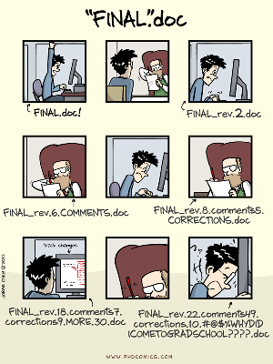
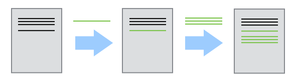
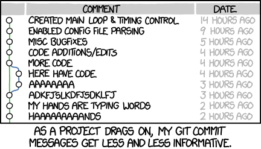

# Before we start {style="text-align: center;" .center}

## Initial questions

* Question 1
* Question 2

## Agenda for today

* Introduction
* etc.

# Introduction {style="text-align: center;" .center}

## Learning objetives

* Learning objective 1
* Learning Objective 2

## Column example

:::: {.columns}
::: {.column width="50%"}

[](https://phdcomics.com/comics/archive.php?comicid=1531){data-preview-link="true"}

PhD Comics "[FINAL.doc](https://phdcomics.com/comics/archive.php?comicid=1531){data-preview-link="true"}"

:::
::: {.column width="50%"}

#### Or from a code perspective...

```
my_analysis.R
my_analysis_FINAL.R
my_analysis_FINAL_v2.R
my_analysis_FINAL_v2_REVIEWED.R
my_analysis_FINAL_v2_REVIEWED_Jan.R
my_analysis_THIS_ONE.R
```

:::
:::

## Bullet points

* bullet 1
* bullet 2

**Version control is like an unlimited ‘undo/redo’.**

## Image example {.smaller}

Version control is like a 'recording' of history



...Rewind and play changes back again!

## Callout example? {.smaller}

some text here

::: {.callout-tip}
Callout wirh data-preview link [**reproducible research**](https://book.the-turing-way.org/){data-preview-link="true"}
:::


## Example with r-fit-text {.smaller}

<br />

::: {.r-fit-text }

```
Working Directory  →  Staging Area         →    Repository
   (your files)       (selected changes)        (permanent snapshot)
```

:::

Think of it like writing a paper:

- **Working Directory** → your working draft
- **Staging Area** → pages you've selected to submit
- **Repository** → the final, submitted version (that you can still revise!)

## The commit: heart of Git {.smaller}

## Example with icons {.nostretch}
What is likely to happen…

{width="50%"}

```
✅ "Recode income variable to quintiles for Table 3"
❌ "fixed stuff"
❌ "asdfgh"
```


## Your feedback matters! 

{fig-align="center"}

Link: [https://forms.cloud.microsoft/e/dZwq7DAWPE](https://forms.cloud.microsoft/e/dZwq7DAWPE)


## Any question? {style="text-align: center;" .center background-image="/images/just_science_done_right.png" background-position="top right" background-repeat="no-repeat" background-size="15%" .smaller}

::: {style="text-align: center; margin-top: 1em"}
Simone Sacchi

Research Data Librarian, EUI Library

[simone.sacchi@eui.eu](mailto:simone.sacchi@eui.eu) | [resdata@eui.eu](mailto:resdata@eui.eu)

[**EUI Library Research Data Guide**](https://eui.libguides.com/research-data-guide){data-preview-link="true"} - [**EUI Library Trainings**](https://www.eui.eu/events?u=lib){data-preview-link="true"}

{fig-align="center" width="60%"}
:::

## Essential resources
[*Happy Git and GitHub for the useR*](https://happygitwithr.com/) by Jenny Bryan — free online, written for researchers.


## End of the presentation {style="text-align: center;" .center}

## BACKUP SLIDES {style="text-align: center;" .center}